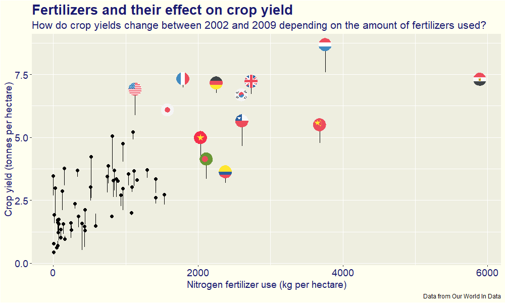

This week, #TidyTuesday was about analyzing data from [Our World in Data](https://ourworldindata.org/) around Crop yields.

I played around with [this](https://github.com/rensa/ggflags) adaptation of the [ggflags](https://github.com/ellisp/ggflags) package.

