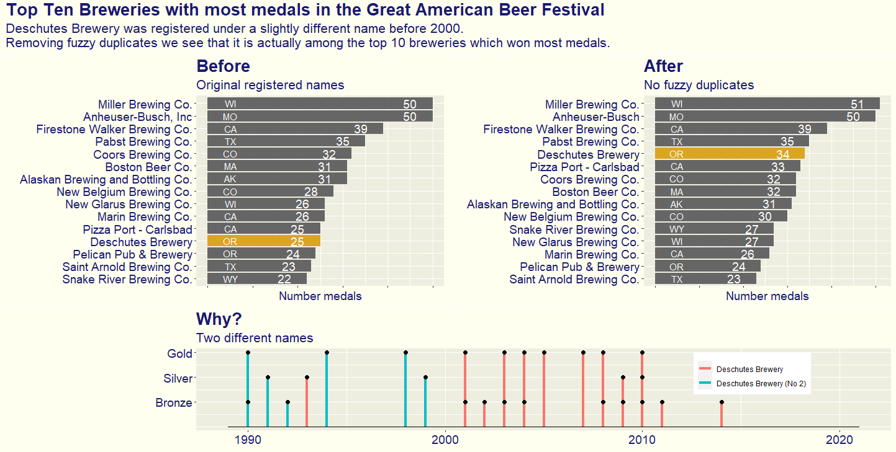

Another application of Fuzzy duplicates.

This week I actually applied it twice. Once with the city name and the brewery name together (to prevent joining breweries with similar names but from different cities) and then only with the brewery name.

Using:
- {stringdist} package
- {patchwork} for arranging and combining the plots.
- I was trying to add the winning beer names with {ggrepel} but it added more clutter and did not contribute to the story.

