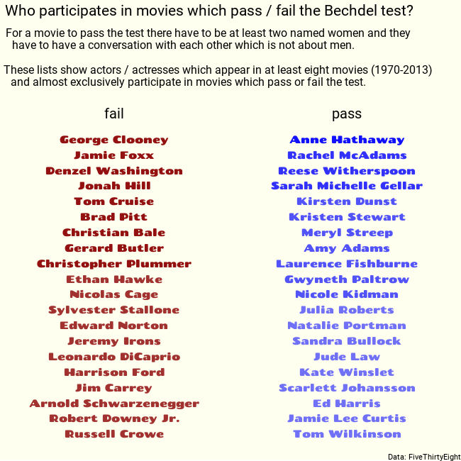

What I learned:

- I used tidyr::separate_rows() for the first time, to split the actors' names
- I played around with ggstream (although I did not use it in the final submission)
- In the theme() function, used hjust and margin for the first time.

