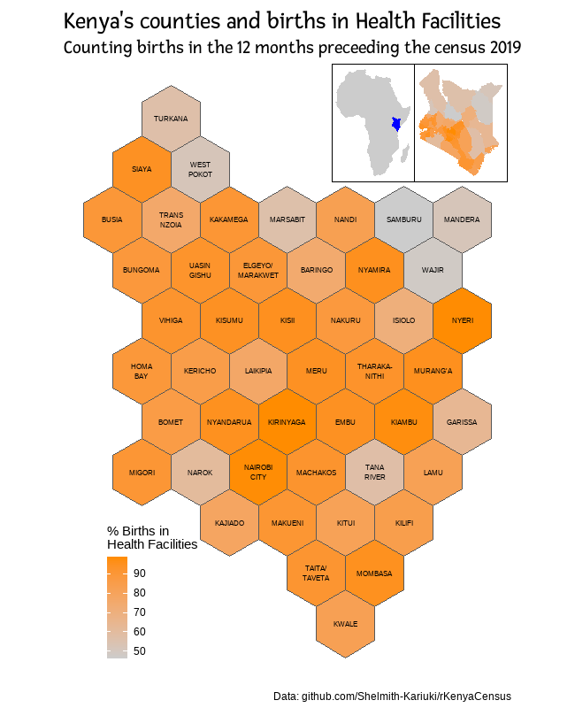

What I learned:

- Awesome package [rKenyaCensus](https://github.com/Shelmith-Kariuki/rKenyaCensus) by Shelmith Kariuki
- [geogrid](https://github.com/jbaileyh/geogrid), to convert a shapefile in a hexagon shapefile
- using the [inset_element()](https://patchwork.data-imaginist.com/reference/inset_element.html) function from patchwork

