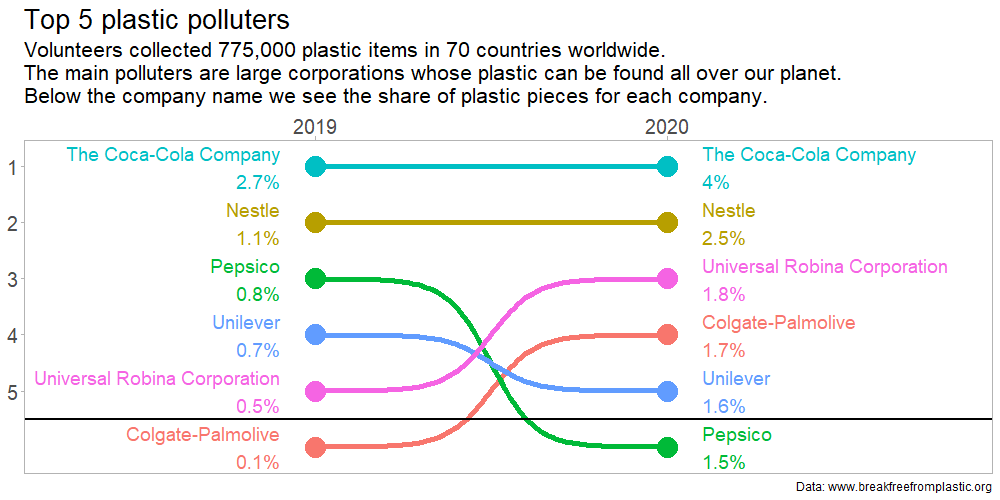

What I learned:

- To use the cool {ggbump} package.
- After using fuzzy deduplication for the third time, I decided to put it in a package: [fuzzymatch](https://github.com/richardvogg/fuzzymatch)

