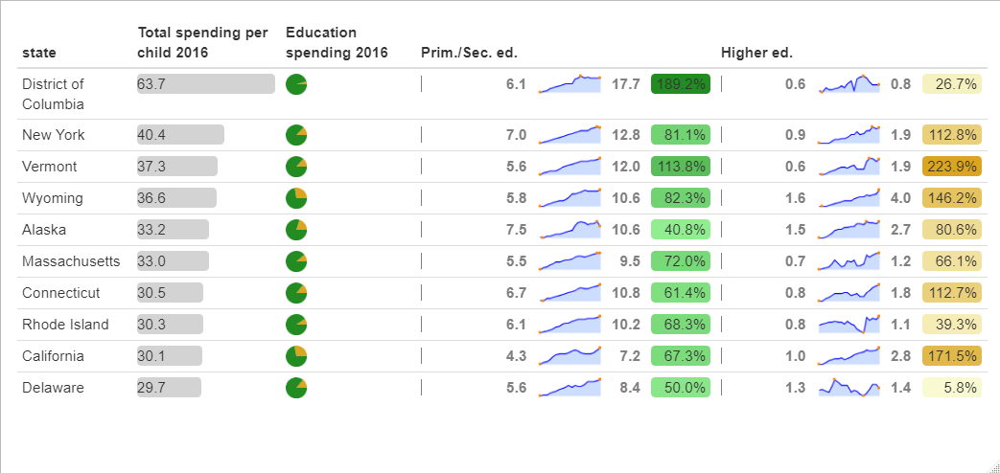

# tidy-tuesdays

Some codes and visualizations for Tidy Tuesdays. Official repository with a lot of interesting datasets can be found [here](https://github.com/rfordatascience/tidytuesday).

I invite you to see the output visualizations and codes in each folder.

