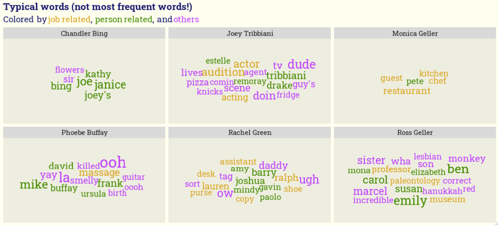

# Friends

The dataset contains all the dialogs from the sitcom.
I wanted to see which are the typical words of each character, i.e. words that are (almost) only used by this character.

I learned
* how to count word frequencies quickly with the tidytext package.
* how to create wordclouds inside ggplot with ggwordcloud.
* how to use fonts from google fonts.
* how to highlight words in the title with ggtext.
