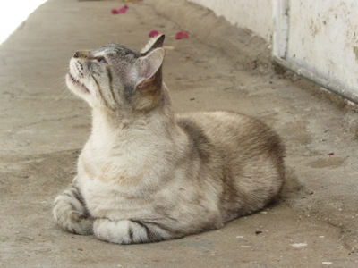
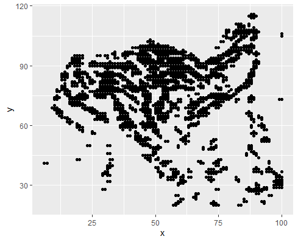
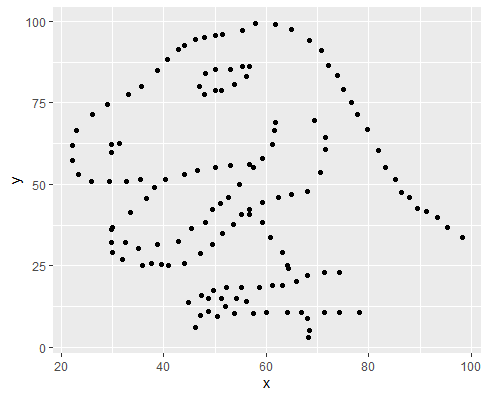
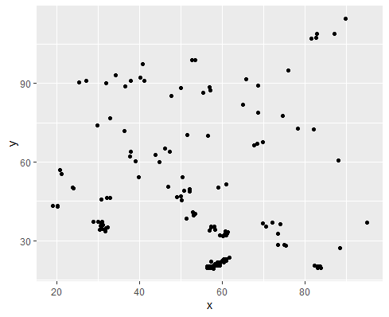

### What I learned this week

* Image processing with {magick}
* Using {metamer} to create metamers (datasets which are different but share some statistical properties) - check [this blogpost for more](https://eliocamp.github.io/codigo-r/en/2019/01/statistical-metamerism/).
* Convert an image into a scatterplot

