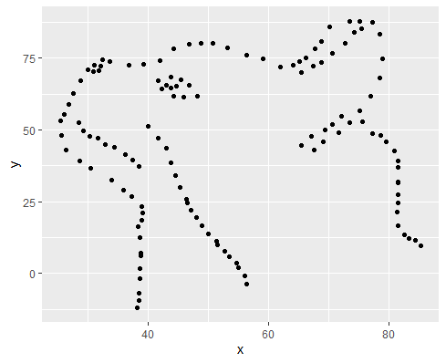
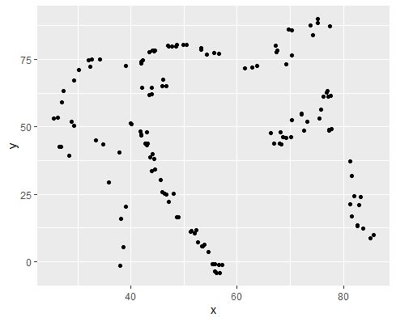

### What I learned this week

* Image processing with {magick}
* Using {metamer} to create metamers (datasets which are different but share some statistical properties) - check [this blogpost for more](https://eliocamp.github.io/codigo-r/en/2019/01/statistical-metamerism/).
* Convert an image into a scatterplot

This is the version after image processing:

Now I would like to have this plot to have the same mean(x), mean(y), sd(x), sd(y) and cor(x,y) as this dino.

I used this as an input:

After applying metamerize, this is the output:

